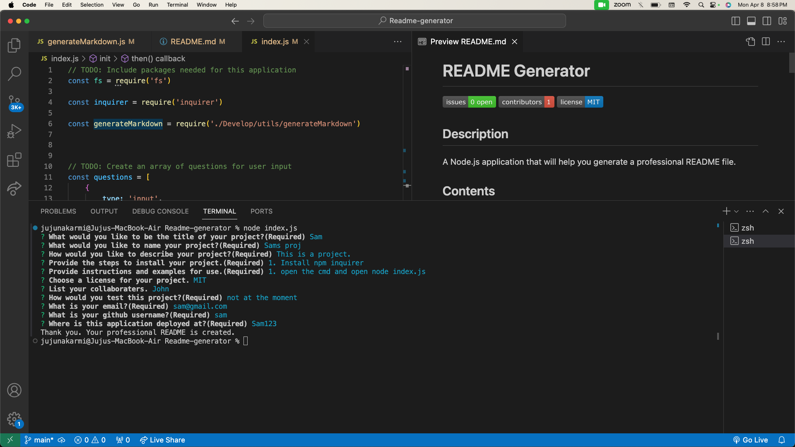

# README Generator
[](https://github.com/jujunakarmi/readme-generator/issues) [](https://github.com/jujunakarmi/readme-generator/graphs/contributors) 

## Description
A Node.js readme generator application that will help you generate a professional README file.
            
## Contents
* [Installation](#installation)
* [Usage](#usage)
* [Screenshots](#screenshots)
* [Built With](#built-with)
* [License](#license)
* [Contributing](#contributing)
* [Tests](#tests)
* [Questions](#questions)
* [Credits](#credits)

## Installation
To use this application, please install: 
```
npm inquirer
```
    
## Usage
First of all you need to clone the repo in your local. Open the cloned repo in your VS code. Click on the index.js on your vs code explorer. Then run index.js in the terminal. Install npm inquirer,after installing the inquirer, run index.js via command prompt and follow prompts to enter required fields and select from optional additional fields. The README will be created in the ./dist folder. 
    
### Screenshots


## Built With

* JavaScript
* Node.js
    
## License
This application is licensed under the MIT license.
    
## Contributing
There are no guidelines for contributing at this time.
    
## Tests
To run tests on the application, install
```
There is no test information for this application at this time.
```


 ## Demo Video
[LINK TO THE VIDEO](https://drive.google.com/file/d/1o2DYBsFSUZGH5PKMhj7BdppRg0Dmv14R/view)
## Questions
If you have any questions about the repo, please [open an issue](https://github.com/Jujunakarmi/Readme-generator/issues) or contact me via email at jujunakarmi@gmail.com. You can find more of my work on my GitHub, [jujunakarmi](https://github.com/Jujunakarmi).
    


    
